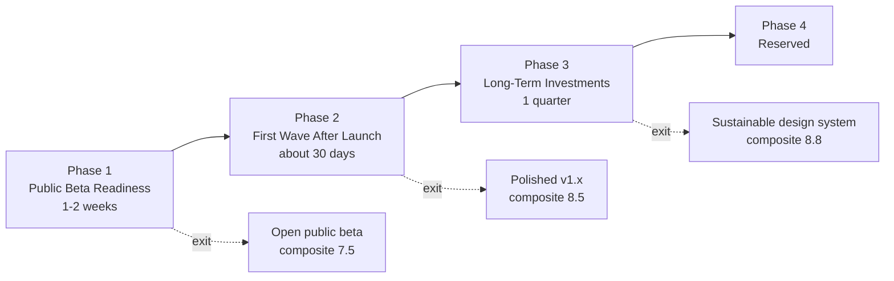

# VECTOR Roadmap // VECTOR 路线图

> Source of truth for "what we ship next". Each Phase has a hard exit
> checklist; **do not start Phase N+1 until every checkbox in Phase N is
> green**. Items map back to [`EVALUATION.md`](./EVALUATION.md) section
> numbers in parentheses.
>
> 本文件为**双语版**：英文是规范性 checklist（authoritative），中文是
> 「执行要点 / 关键信息 / 工时估算 / 验证脚本」补充材料，方便协作与
> 异步交接。两个语言版本若出现冲突，以英文 checklist 为准。

---

## 0. 给执行 Agent 的开场指令 (Kickoff Prompt for Execution Agents)

> 把下面这一段（连同三条反引号一起）整段复制粘贴给新会话/新模型，把
> `{N}` 替换成你想执行的 Phase 编号即可。

```text
你是一个自主编码 agent，在 macOS 工作区
`/Users/jianma/Desktop/vector-life-design-guide-v1.0.5-optimized-full`
下工作。

【任务】
按 ROADMAP.md 中 Phase {1|2|3|4} 的 exit checklist 逐项落实。除非该
Phase 的所有 checkbox 全部 ✅，**严禁**进入下一 Phase。

【上下文阅读顺序，开工前必须全部读完】
1. ROADMAP.md（本路线图，重点读 Phase {N}）
2. EVALUATION.md（项目当前 12 维度评分与问题清单）
3. README.md、package.json、server.ts、services/securityService.ts、
   hooks/useDiaryData.ts、App.tsx
4. 当前实际状态校验（必跑）：
   - npm run lint
   - npm test
   - rg "ITERATIONS = " services/securityService.ts
   - rg "mirrorDiaryValue\(keys\.password" hooks/
   - rg "unpkg.com" components/
   - rg "useReducedMotion|prefers-reduced-motion" components/ hooks/
   - ls -la .env.local 2>/dev/null \
       && echo "WARNING: .env.local 仍存在"

【执行规则 / Working agreements】
- 每个 task 完成后跑 `npm test && npm run lint`，红灯立刻停下修复，
  不得跳过。
- 任何 `localStorage.setItem` 调用必须经过 `services/browserStorage.ts`。
- 任何对外 fetch 必须 5 秒超时 + AbortController。
- 任何新组件文件不得超过 400 行；大于 350 行需要同步抽出 hook 或子组件。
- 凡涉及加密 / 密码 / AI key 的改动，必须**保留旧版本兼容路径**，禁止
  破坏性升级。
- 完成 Phase {N} 全部 exit checklist 后，运行
  `scripts/check-beta.sh`（若存在），并在 `CHANGELOG.md` 写入本次
  变更条目。

【交付】
最后用 markdown 输出：
1. 每个 task 的 done / skipped / blocked 状态
2. 退出条件 checklist 的实际通过情况（每条标 ✅ 或 ❌+原因）
3. 触发 follow-up 的新发现（如果有）

现在开始 Phase {N}，从第一条 task 开始。
```

---

## 0.1 上一轮「完成 vs 漏掉」对照 (Previous Round: Done vs Missed)

> 必须先把这张表对齐，否则下一轮会重蹈覆辙。

### 上一轮真正完成 (What was actually delivered)

| 类别         | 完成项                                                                                                                  | 关键证据                                           |
| ------------ | ----------------------------------------------------------------------------------------------------------------------- | -------------------------------------------------- |
| 服务端       | helmet 严格 CSP（仅生产）、Origin allowlist + 可选 Bearer 双闸、log 脱敏、requestId、bind 127.0.0.1、`x-powered-by` off | `server.ts:261–287`、`server/aiProxyAuth.ts:31–52` |
| 工程化       | ESLint + Prettier + typescript-eslint + react / react-hooks / unused-imports 插件                                       | `package.json` devDeps                             |
| 客户端可观测 | Sentry 含 `sendDefaultPii: false` + `beforeSend / beforeBreadcrumb` 脱敏                                                | `index.tsx:21–43`                                  |
| 抽取 hooks   | `useNowTick / useViewerStars / useBackupImport / useAttachmentUpload`                                                   | `hooks/` 目录                                      |
| 测试扩展     | e2e 1→3 spec（api / app / backup）、unit ~107→~150 case                                                                 | `e2e/`, `*.test.*`                                 |
| 安全细节     | hash 串带版本号、constant-time compare、wipe sensitive                                                                  | `services/securityService.ts`                      |

### 上一轮**明确漏掉** (Items explicitly flagged as P0/P1 last round but **not done**)

> ⚠️ 这 14 项必须在本轮按 Phase 1-3 全部消化。

| #   | 漏点                                              | 当前证据                                                                                        | 风险                           | 归属 Phase |
| --- | ------------------------------------------------- | ----------------------------------------------------------------------------------------------- | ------------------------------ | ---------- |
| 1   | PBKDF2 仍 100k（OWASP 2026 推荐 600k）            | `securityService.ts:11` `ITERATIONS = 100000`                                                   | 离线爆破                       | Phase 1    |
| 2   | passwordHash/Salt 仍 localStorage mirror          | `useDiaryData.ts:253–263`                                                                       | XSS 后即可拿 hash              | Phase 1    |
| 3   | `.env.local` 仍存在于工作目录                     | 12 行非空                                                                                       | 复制粘贴泄露                   | Phase 1    |
| 4   | PDF worker 仍走 unpkg CDN                         | `PdfAttachmentViewer.tsx:6`                                                                     | 供应链 + 离线挂 + CSP 必开口子 | Phase 1    |
| 5   | prompt injection 服务端无防护                     | `server.ts:343` 直接转发                                                                        | 启明星可被劫持                 | Phase 1    |
| 6   | `prefers-reduced-motion` 仓库 0 命中              | grep 0 hit                                                                                      | a11y 红线                      | Phase 1    |
| 7   | viewport `maximum-scale=1.0, user-scalable=no`    | `index.html:5`                                                                                  | WCAG 1.4.4 失败                | Phase 1    |
| 8   | 无全局 `:focus-visible`                           | grep 0 hit                                                                                      | 键盘用户不可见                 | Phase 1    |
| 9   | 无 `eslint-plugin-jsx-a11y`                       | `package.json` 无                                                                               | a11y 漏检                      | Phase 1    |
| 10  | 无 LICENSE / PRIVACY / TERMS / SECURITY           | 仓库 0 hit                                                                                      | GDPR / 开源合规                | Phase 1    |
| 11  | 4 大巨型组件**反向变大**                          | Viewer 1156→**1247**，Dashboard 851→**983**，MasterLock 720→**866**，新增 SettingsPanel **988** | 维护成本爆炸                   | Phase 2    |
| 12  | `addMaterial / deleteMaterial` stale closure 未修 | `useDiaryData.ts:292–314`                                                                       | 快速点击丢更新                 | Phase 2    |
| 13  | `App.tsx` 顶层 15 字段 destructure                | `App.tsx:36–52`                                                                                 | 整树重渲                       | Phase 2    |
| 14  | `vitest` 无 coverage thresholds                   | `vitest.config.ts`                                                                              | 覆盖率自然漂移                 | Phase 2    |

### 本轮**首次纳入** (First-time additions, all production-launch necessary)

| #   | 新增关注点                              | 必要性                   | 归属 Phase |
| --- | --------------------------------------- | ------------------------ | ---------- |
| 15  | 服务端 Sentry（仅客户端不够）           | 服务端崩溃完全黑盒       | Phase 1    |
| 16  | SIGTERM graceful shutdown               | K8s / PM2 滚动发布丢请求 | Phase 1    |
| 17  | `dist/assets/*` immutable cache headers | 用户浏览器拉重复包       | Phase 1    |
| 18  | web-vitals → Sentry                     | 无生产性能 SLI           | Phase 2    |
| 19  | Morning Star SSE streaming              | AI 体验代差              | Phase 2    |
| 20  | 1200×630 OG image + maskable icon       | 社交分享 / PWA 安装质感  | Phase 1    |
| 21  | AI 输出免责条带                         | EU AI Act / 加州 SB-1001 | Phase 1    |

---

## 0.2 阶段总览 (Phase Overview)



| 阶段                              | 工期     | 综合分目标    | 退出条件简述                                                  |
| --------------------------------- | -------- | ------------- | ------------------------------------------------------------- |
| Phase 1 — Public Beta Readiness   | 1-2 周   | 6.6 → **7.5** | 安全 / a11y / 法务 / 可靠性 / 品牌资产五条红线全 pass         |
| Phase 2 — First Wave After Launch | ~30 天   | 7.5 → **8.5** | AI streaming / web-vitals / 巨型组件 ≤ 350 行 / coverage 阈值 |
| Phase 3 — Long-Term Investments   | 1 个季度 | 8.5 → **8.8** | tokens 全 scale / Storybook / 智者 portrait / Argon2id 评估   |
| Phase 4 — Reserved                | TBD      | TBD           | 留给企业 / 分发方向                                           |

---

## Phase 1 — Public Beta Readiness (was P0)

Goal: pass the bar for "open-registration small public SaaS / personal PWA"
described in `EVALUATION.md` §三. Estimated effort: 1–2 weeks of focused work.

### Exit checklist

#### 1.1 Security (§8)

- [ ] PBKDF2 default iterations ≥ 600,000 (env-overridable; verifies
      against older `pbkdf2-sha256:v1` hashes without re-encryption).
- [ ] `passwordHash` / `passwordSalt` are **not** mirrored to localStorage
      (`hooks/useDiaryData.ts`); existing mirrored values are migrated into
      IndexedDB and removed.
- [ ] `react-pdf` worker loads from a same-origin asset, not from
      `https://unpkg.com/...`.
- [ ] `.env.local` is removed from the repo working tree; `.env.example`
      stays as the only template; README warns about leaked OpenRouter
      keys needing rotation.
- [ ] Server-side `/api/morning-star` wraps user prompts in a fixed
      delimiter envelope **and** rejects obvious instruction-injection
      keywords ("you are now …", "ignore previous instructions", "system:")
      before forwarding to upstream LLMs.

#### 1.2 Accessibility (§3 / §4)

- [ ] `index.html` viewport meta no longer carries
      `maximum-scale=1.0, user-scalable=no`.
- [ ] `eslint-plugin-jsx-a11y` is wired into the flat ESLint config and
      `npm run lint` is clean (`--max-warnings=0`).
- [ ] Global `:focus-visible` style added to `index.css` so keyboard focus
      is visible against both themes.
- [ ] All `motion/react` animations either respect `useReducedMotion()` or
      are wrapped by a shared helper that does.
- [ ] One `@axe-core/playwright` spec runs against the cover and onboarding
      shells; serious/critical violations fail CI.

#### 1.3 Legal (§12)

- [ ] `LICENSE` exists at the repo root (suggested AGPL-3.0 or MIT — pick
      one in the changelog entry).
- [ ] `PRIVACY.md` covers: local-only by default, what leaves the device
      when AI calls are made, log scrubbing, retention, contact channel.
- [ ] `TERMS.md` covers: AI output is informational only (not medical /
      legal / financial advice), user owns their entries, abuse policy.
- [ ] `SECURITY.md` describes how to report a vulnerability.
- [ ] `package.json` adds `license`, `repository`, `author` fields.
- [ ] Morning Star output (`components/MorningStarPanel.tsx`) renders a
      visible AI disclaimer banner on every analysis result.

#### 1.4 Reliability / Observability (§10)

- [ ] `server.ts` initialises `@sentry/node` when `SENTRY_DSN` is set; same
      scrubbing rules as the browser SDK.
- [ ] `server.ts` installs `SIGTERM` / `SIGINT` graceful shutdown that
      closes the HTTP listener and clears outstanding timers.
- [ ] `dist/assets/*` is served with
      `Cache-Control: public, max-age=31536000, immutable`; `index.html`
      keeps `no-cache`.

#### 1.5 Brand assets (§2)

- [ ] `public/og.png` (1200×630) referenced from `index.html` Open Graph
      and Twitter card meta tags. (If a hand-drawn asset is not available,
      ship a minimal Inter-on-archive-grid placeholder generated in the
      same build step.)
- [ ] `manifest.json` references at least 192 and 512 maskable PNG icons.

#### 1.6 Process

- [ ] `CHANGELOG.md` records this Phase 1 release entry.
- [ ] `scripts/check-beta.sh` exits 0 (runs lint, typecheck, test, build,
      and validates each Phase 1 invariant via grep/file-check).
- [ ] All E2E specs (`api.spec.ts`, `app.spec.ts`, `backup.spec.ts`,
      and the new a11y spec) pass.

### 中文执行要点 (Chinese execution notes)

#### 关键任务工时估算 (Effort estimates)

| ID    | 对应英文 checklist 条目                                                          | 关键文件                                                | 工时 |
| ----- | -------------------------------------------------------------------------------- | ------------------------------------------------------- | ---- |
| 1.1.a | PBKDF2 ≥ 600k；hash 串新增 `iter` 段并兼容旧 v1                                  | `services/securityService.ts`, `*.test.ts`              | 2h   |
| 1.1.b | 删除 hash / salt localStorage mirror，并迁移已有镜像值到 IDB                     | `hooks/useDiaryData.ts`, `services/diaryStorage.ts`     | 1h   |
| 1.1.c | 删除 `.env.local`，**先吊销** `sk-or-v1-f364a30c…` 重发新 key                    | `.env.local`, OpenRouter dashboard                      | 0.5h |
| 1.1.d | PDF worker 本地化（`pdfjs-dist/build/pdf.worker.min.mjs?url`）                   | `components/PdfAttachmentViewer.tsx`, `vite.config.ts`  | 1h   |
| 1.1.e | prompt injection 防护：服务端固定 envelope + 关键词正则                          | `server.ts`, `services/geminiService.ts`                | 3h   |
| 1.2.a | 全局 `useReducedMotion`：抽 `hooks/useMotionPreset.ts`，所有动画走它             | `motion/react` 调用点（约 12 处）                       | 3h   |
| 1.2.b | 修 viewport + 加 `:focus-visible` + `<div as="div">` 按钮加 `tabIndex/onKeyDown` | `index.html`, `index.css`, `components/CyberButton.tsx` | 1.5h |
| 1.2.c | 接入 `eslint-plugin-jsx-a11y` 并修零                                             | `eslint.config.*`, 全组件                               | 2h   |
| 1.2.d | `axe-playwright` 在 cover/onboarding 上跑通                                      | `e2e/a11y.spec.ts`                                      | 2h   |
| 1.3.a | 写 LICENSE / PRIVACY / TERMS / SECURITY / CHANGELOG（中英双语）                  | 仓库根                                                  | 3h   |
| 1.3.b | Morning Star 顶部 AI 免责条带（含 i18n 7 语 key）                                | `components/MorningStarPanel.tsx`, `i18n/locales/*`     | 1.5h |
| 1.4.a | 服务端 Sentry init + Express middleware                                          | `server.ts`, 新增 `server/observability.ts`             | 2h   |
| 1.4.b | SIGTERM/SIGINT graceful shutdown                                                 | `server.ts`                                             | 1h   |
| 1.4.c | `dist/assets/*` immutable cache + `index.html` `no-cache`                        | `server.ts:392–397`                                     | 1h   |
| 1.5.a | 设计 / 导出 OG image + maskable PWA icon set                                     | `assets/`, `manifest.json`, `index.html`                | 4h   |

**Phase 1 总工时约 ~30 小时（≈ 1 个工程师全职 1 周，或两人分工 3-4 天）**

#### 关键信息 / 不可妥协项 (Hard constraints)

> 🚩 这些不是建议，是红线：
>
> 1. **PBKDF2 升级必须保留旧 hash 兼容**——已经有用户用 100k 注册，强制
>    升级会让他们无法登录。`verifyPassword` 已经按 hash 内嵌 iter 走，
>    本任务**只改 `hashPassword` 的默认 iter**，**不动 verify 逻辑**。
> 2. 删除 `.env.local` 之前**必须先吊销 key**，否则 git log / 备份 /
>    Spotlight 索引可能仍泄露。
> 3. PDF worker 本地化后 `vite.config.ts` 的 `manualChunks.pdf` 分组要
>    保留，否则 worker 会被打到主包。
> 4. AI 免责条带不是「加个 `<div>` 写两行字」——必须 7 语都到位，否则
>    非中英用户看到空白会更不专业。
> 5. SIGTERM 必须 `await server.close()` 而不是 `process.exit(0)`，
>    否则正在跑的 morning-star 请求（最长 60s）会被中断、用户看到 502。
> 6. 服务端 Sentry 的 scrub 规则**必须复用** `server.ts` 已有的
>    `REDACT_PATTERNS / scrubLogText`，不要在 Sentry SDK 里重写一套，
>    否则两套规则会漂移。

#### Phase 1 出口验证脚本 (草案，建议落到 `scripts/check-beta.sh`)

```bash
#!/bin/bash
set -euo pipefail

# Security
grep -q "ITERATIONS = 600_000" services/securityService.ts \
  || { echo "FAIL: PBKDF2 still <600k"; exit 1; }
! rg -q "mirrorDiaryValue\(keys\.passwordHash" hooks/ \
  || { echo "FAIL: hash still mirrored"; exit 1; }
! test -f .env.local \
  || { echo "FAIL: .env.local still present"; exit 1; }
! rg -q "unpkg.com" components/ \
  || { echo "FAIL: PDF worker still on CDN"; exit 1; }

# a11y
test "$(rg -c 'useReducedMotion|prefers-reduced-motion' components/ hooks/)" -ge 8 \
  || { echo "FAIL: reduced-motion coverage too low"; exit 1; }
! rg -q "maximum-scale=1.0" index.html \
  || { echo "FAIL: viewport still locked"; exit 1; }

# Legal
for f in LICENSE PRIVACY.md TERMS.md SECURITY.md CHANGELOG.md; do
  test -f "$f" || { echo "FAIL: missing $f"; exit 1; }
done

# Build sanity
npm run lint --silent
npm test --silent
npm run build --silent

echo "Phase 1 OK — Beta baseline reached"
```

---

## Phase 2 — First Wave After Launch (was P1)

Goal: improve perceived AI quality, observability and code health within
~30 days of Phase 1 release.

### Exit checklist

- [ ] Morning Star streams responses (SSE or chunked fetch) through both
      the OpenRouter and Gemini code paths.
- [ ] Failure UI offers retry / switch provider / switch persona inline.
- [ ] `⌘K` global command palette + at least `⌘N` / `⌘.` shortcuts.
- [ ] `web-vitals` reports LCP / INP / CLS to Sentry.
- [ ] Attachment images use Blob URLs instead of base64 in DOM.
- [ ] Google Fonts is either subsetted or self-hosted from
      `public/fonts/`.
- [ ] Service worker caches the app shell + static assets; offline shell
      renders without network.
- [ ] In-app banner reminds the user when last successful backup is older
      than 60 days (uses `lastBackupAt` recorded by `useBackupImport`).
- [ ] `Viewer.tsx`, `Dashboard.tsx`, `MasterLock.tsx`, `SettingsPanel.tsx`
      each ≤ 350 LOC; `npm run lint` enforces `max-lines: 400` for new
      `.tsx` files.
- [ ] `addMaterial` / `deleteMaterial` (and any other reducer-style
      handler) use functional `setState(prev => ...)`.
- [ ] `App.tsx` consumes `useAppStore` via `useShallow` selector(s) or
      narrow custom hooks.
- [ ] Vitest coverage thresholds: lines ≥ 70%, branches ≥ 60%.
- [ ] Playwright specs use `data-testid` attributes for the smoke flows
      so i18n changes do not break them.

### 中文执行要点

#### 关键任务工时估算

| ID  | 对应英文 checklist 条目                                                                                     | 工时 |
| --- | ----------------------------------------------------------------------------------------------------------- | ---- |
| 2.a | OpenRouter SSE 透传（保留 abort + rate-limit + log 脱敏）                                                   | 6h   |
| 2.b | 前端 streaming 渲染 + Markdown 增量解析                                                                     | 6h   |
| 2.c | service worker（vite-plugin-pwa 或手写）+ 离线横幅 + update 提示                                            | 4h   |
| 2.d | 备份提醒：localStorage 记录 `lastBackupAt`，Dashboard 顶部 banner                                           | 2h   |
| 2.e | `⌘K` 命令面板（cmdk 库或自实现）                                                                            | 6h   |
| 2.f | ESLint `max-lines: 400` + 历史例外白名单（白名单仅过渡用）                                                  | 0.5h |
| 2.g | Viewer 拆 5 个：`useViewerEntry / useViewerDecryption / useMorningStarPipeline / ViewerHeader / ViewerBody` | 8h   |
| 2.h | Dashboard 拆 4 个：`DashboardCommands / DashboardEmptyState / useVaultGate / useDashboardSelection`         | 8h   |
| 2.i | MasterLock 拆 3 个：`useLockoutTimer / useRecoveryFlow / MasterLockBackdrop`                                | 6h   |
| 2.j | SettingsPanel 拆 4 个：`SettingsSecurity / SettingsAI / SettingsAppearance / SettingsBackup`                | 6h   |
| 2.k | `useDiaryData` 全函数式 setState；`App.tsx` 切细粒度 hook                                                   | 4h   |
| 2.l | data-testid 渐进迁移（仅当前 e2e 用到的元素）                                                               | 4h   |
| 2.m | web-vitals 上报到 Sentry custom metric                                                                      | 2h   |
| 2.n | vitest coverage thresholds + CI 卡红                                                                        | 1h   |
| 2.o | 5 个巨型组件单测（每个 ≥ 5 case）                                                                           | 8h   |

**Phase 2 总工时约 ~70 小时（≈ 2 周全职，或两人 5-6 天）**

#### 关键信息 / 不可妥协项

> 🚩
>
> 1. SSE 透传**绝对不能**回传上游 raw error body（含 OpenRouter 内部
>    url / headers），用 `scrubLogText` 也要扫一遍 stream chunk。
> 2. service worker 第一次部署会缓存住 `index.html`，**必须配 update flow**
>    （监听 `updatefound` → 弹「新版本可用，点击刷新」），否则用户永远
>    卡老版本。
> 3. ESLint `max-lines` 不要无脑设 400 然后给历史 4 个文件加
>    `// eslint-disable-next-line max-lines` —— 那等于没规则。**先把 4 个
>    文件砍下来再开规则**。
> 4. 巨型组件拆分**不要追求一次性完美**，按「先抽 hook → 再拆 view →
>    最后再 polish」的节奏走，每步都要有 PR 单独 review。
> 5. web-vitals 不要用 `Sentry.captureMessage`，要用
>    `Sentry.metrics.distribution('lcp', value)`，否则会被采样吃掉。
> 6. SSE 在某些代理后失效（Cloudflare / nginx buffering），必须带
>    `Cache-Control: no-transform` + `X-Accel-Buffering: no`，并保留
>    非流式 fallback。

#### Phase 2 视觉化拆分目标

```mermaid
flowchart TB
  subgraph before [Phase 2 之前]
    V1[Viewer.tsx 1247]
    D1[Dashboard.tsx 983]
    M1[MasterLock.tsx 866]
    S1[SettingsPanel.tsx 988]
  end

  subgraph after [Phase 2 之后]
    V2[Viewer.tsx ≤350]
    Vh1[useViewerDecryption]
    Vh2[useMorningStarPipeline]
    Vc1[ViewerHeader]
    Vc2[ViewerBody]

    D2[Dashboard.tsx ≤350]
    Dh1[useVaultGate]
    Dc1[DashboardCommands]
    Dc2[DashboardEmptyState]

    M2[MasterLock.tsx ≤350]
    Mh1[useLockoutTimer]
    Mh2[useRecoveryFlow]

    S2[SettingsPanel.tsx ≤350]
    Sc1[SettingsSecurity]
    Sc2[SettingsAI]
    Sc3[SettingsAppearance]
    Sc4[SettingsBackup]
  end

  V1 --> V2 & Vh1 & Vh2 & Vc1 & Vc2
  D1 --> D2 & Dh1 & Dc1 & Dc2
  M1 --> M2 & Mh1 & Mh2
  S1 --> S2 & Sc1 & Sc2 & Sc3 & Sc4
```



---

## Phase 3 — Long-Term Investments (was P2)

Goal: make the design system and product story sustainable.

### Exit checklist

- [ ] `index.css` (or `lib/designTokens.ts`) exposes a complete set of
      tokens: color, spacing, radius, shadow, motion, z-index. No hex /
      rgba literal allowed in any `.tsx` file (lint rule).
- [ ] `/styleguide` route or Storybook serves all base components in dev.
- [ ] Bespoke portrait illustrations (or stylised geometric variants) for
      the seven default guiding stars replace the Lucide icon stand-ins.
- [ ] Star-field decorations (`CoverScreen`, `MasterLock`, …) consolidated
      into a single reusable component / hook.
- [ ] Argon2id evaluation written up in `docs/security/argon2-eval.md`
      with a go / no-go decision.
- [ ] First-day empty-state ships sample reflections + a mocked Morning
      Star call so users see the value proposition without spending
      OpenRouter quota.
- [ ] Optional shareable "reflection card" export (privacy-aware: image
      contains only what user opts in).

### 中文执行要点

#### 关键任务工时估算

| ID  | 对应英文 checklist 条目                                                          | 工时   |
| --- | -------------------------------------------------------------------------------- | ------ |
| 3.a | 设计 tokens 全 scale + 重构所有组件引用 token                                    | 3 天   |
| 3.b | Storybook 接入 + 10 个核心组件 stories                                           | 2 天   |
| 3.c | 7 位智者 portrait（外包 / AI 生成 + 人工 polish）                                | 1 周   |
| 3.d | i18n drift 脚本 + CI（`scripts/i18n-diff.ts` 跑 7 个 locale 的 keyset 完全一致） | 0.5 天 |
| 3.e | Argon2id PoC + benchmark + 决策文档                                              | 2 天   |
| 3.f | 视觉回归 5 张关键屏（Playwright `toHaveScreenshot`）                             | 1 天   |
| 3.g | PWA install 引导（`beforeinstallprompt`）                                        | 0.5 天 |
| 3.h | 分享卡导出（html2canvas / satori，1080×1920 PNG）                                | 2 天   |

**Phase 3 总工时约 3-4 周（含智者 portrait 设计回合）**

#### 关键信息

> 🚩
>
> 1. 「No hex / rgba literal allowed in `.tsx`」这条 lint 规则会一次性
>    亮起几百处违规。**不要一上来就开 `error`**，先用
>    `eslint-plugin-no-restricted-syntax` 设 `warn`，按目录逐步收口
>    （components/Cover → components/Master → … → 最后开 error）。
> 2. Argon2id 评估必须包含 **iOS Safari + 低端 Android** 上的真实
>    benchmark（wasm 加载 + 单次派生），不能只看 desktop Chrome。
> 3. 智者 portrait 即便是几何抽象，也要**统一比例 / 统一 padding /
>    统一描边色**，否则 7 张并排会出现明显的"风格不齐"。
> 4. 分享卡导出必须默认**不**包含日记原文，仅含「用户主动勾选的几句」+
>    Morning Star metrics 雷达图，避免一键泄露隐私。

---

## Phase 4 — Reserved (Enterprise / Distribution)

> Not committed yet. Use this slot for whichever direction the product
> takes after Phase 3 (multi-account / SSO, payments, compliance certs,
> mobile native shells, …). Keep this section as a stub until decided.

### Exit checklist

- [ ] _To be filled when Phase 3 is shipped._

---

## Working agreements (apply across all phases)

- Every `localStorage.setItem` must go through `services/browserStorage.ts`.
- Every outbound `fetch` carries a 5s timeout via `AbortController`.
- New component files ≤ 400 LOC; > 350 must extract a hook / sub-component.
- Encryption / password / API key changes must keep a backwards-compatible
  read path.
- After each task finishes, run `npm test && npm run lint`; on red, stop
  and fix before moving on.
- After every Phase, run `scripts/check-beta.sh` and add a `CHANGELOG.md`
  entry under the matching version heading.

### 跨阶段补充约束 (Additional cross-phase agreements)

#### 防止「hook 抽出来 ≠ 组件变小」重演

| 防御层         | 落地动作                                                                                 |
| -------------- | ---------------------------------------------------------------------------------------- |
| Phase 1 内     | `eslint.config.*` 加 `max-lines: ['warn', 600]` 先观察                                   |
| Phase 2 完成时 | 升级为 `max-lines: ['error', 400]`，且**不允许**逐文件 `eslint-disable max-lines` 白名单 |
| 每个 PR        | PR 模板必须填「本 PR 是否新增了组件代码？如是，是否同步抽了 hook 或子组件？」            |

#### 测试纪律

- 每写一个新组件，**同时**写最少 2 个 case（render + 1 个交互）。
- coverage thresholds 只能涨不能降，每月在 `vitest.config.ts` 提 5 个
  百分点。
- e2e 不允许用文案 selector，新加的元素必须带 `data-testid`。

#### 安全纪律

- 任何 `localStorage.setItem` 调用必须经 `services/browserStorage.ts`，
  且通过白名单校验「该 key 是否敏感」。
- 任何对外 fetch 必须 5s 超时 + AbortController。
- `.env.*.local` 永不提交，`.env.example` 永不放真实占位。

#### 文档纪律

- `CHANGELOG.md` 按 [Keep a Changelog](https://keepachangelog.com/) 格式，
  每个 PR 必更。
- 每个 Phase 收尾写一篇 `docs/phase-N-postmortem.md`，记录「做到了什么、
  漏了什么、为什么漏」。

---

## KPI Dashboard (每周 review)

> 把这张表挂在每周站会，分数演不下去就是路线图被卡住的信号。

| 指标                 | 当前    | Phase1 后 | Phase2 后 | Phase3 后         |
| -------------------- | ------- | --------- | --------- | ----------------- |
| 安全分               | 7.8     | **9.0**   | 9.2       | 9.5               |
| a11y 分              | 4.5     | **8.0**   | 8.2       | 8.5               |
| 合规分               | 4.5     | **8.0**   | 8.0       | 8.0               |
| 可观测分             | 6.0     | **8.5**   | 8.5       | 8.5               |
| 测试分               | 7.0     | 7.5       | **8.5**   | 9.0               |
| UX 分                | 6.5     | 6.8       | **8.5**   | 8.7               |
| 架构分               | 6.0     | 6.0       | **8.0**   | 8.5               |
| 设计系统             | 5.5     | 5.5       | 6.5       | **8.5**           |
| **加权综合**         | **6.6** | **7.5**   | **8.5**   | **8.8**           |
| 4 大组件最大行数     | 1247    | 1247      | **≤350**  | ≤350              |
| 组件 jsx-a11y 违规   | 未知    | **0**     | 0         | 0                 |
| 加密迭代轮数         | 100k    | **600k**  | 600k      | Argon2id 评估完成 |
| 仓库公开 markdown 数 | 2       | **6**     | 7         | 9                 |

---

## Risks & Mitigations (风险与备用方案)

| 风险                                         | 概率 | 影响         | 缓解                                                                              |
| -------------------------------------------- | ---- | ------------ | --------------------------------------------------------------------------------- |
| PBKDF2 600k 在低端手机解锁卡顿 > 2s          | 中   | 用户流失     | 给解锁加进度条 + iter 走配置项可降级                                              |
| SSE 在某些代理后失效（Cloudflare buffering） | 中   | AI 体验回退  | 带 `Cache-Control: no-transform` + `X-Accel-Buffering: no`，并保留非流式 fallback |
| service worker 卡老版本                      | 中   | 用户更新延迟 | 必须实装 update flow（监听 `updatefound` → 弹刷新提示）                           |
| 巨型组件拆分中破坏现有功能                   | 高   | 回归         | 每拆 1 个文件先补 5 个单测；必要时用 feature-flag 临时双轨                        |
| Argon2id wasm 体积 ~50KB                     | 低   | 首屏增加     | 仅在解锁路由 lazy load                                                            |
| OG image 在不同平台显示比例不一              | 低   | 品牌折扣     | 提供 1200×630（FB / Twitter）+ 1200×1200（IG）双图                                |

---

## Appendix: 立即可执行的「今天就开始」清单 (Today's first 4 hours)

按下面顺序，**4 小时内**可以完成 Phase 1 的一半：

```
1.  吊销 .env.local 里的 OpenRouter key                      (5  min)
2.  删除 .env.local，重生成只放本地 shell 环境变量            (5  min)
3.  securityService.ts: ITERATIONS 100_000 → 600_000         (5  min)
4.  跑测试，确认旧 hash 兼容                                 (10 min)
5.  PdfAttachmentViewer.tsx 第 6 行换成本地 import           (15 min)
6.  index.html viewport 删 maximum-scale + user-scalable     (2  min)
7.  index.css 加 :focus-visible 全局样式                     (5  min)
8.  装 eslint-plugin-jsx-a11y，npm run lint，按列表修        (90 min)
9.  抽 hooks/useMotionPreset.ts，给最显眼 4 处动画包上
    （CoverScreen / Onboarding / MasterLock / Viewer）       (60 min)
10. 写 LICENSE（MIT 模板，30 秒）+ SECURITY.md               (10 min)
```

剩下的 PRIVACY / TERMS / AI 免责条带 / hash mirror 删除 / prompt
injection 防护留到第 2 个工作单元。
