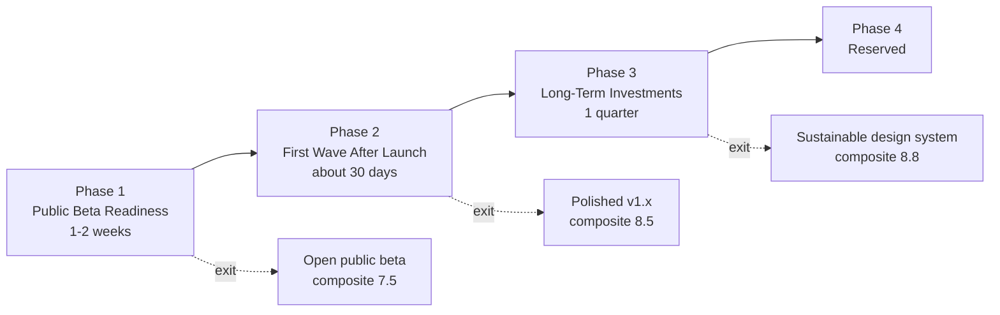

# VECTOR Roadmap // VECTOR 路线图

> Source of truth for "what we ship next". Each Phase has a hard exit
> checklist; **do not start Phase N+1 until every checkbox in Phase N is
> green**. Items map back to [`EVALUATION.md`](./EVALUATION.md) section
> numbers in parentheses.
>
> 本文件为**双语版**：英文是规范性 checklist（authoritative），中文是
> 「执行要点 / 关键信息 / 工时估算 / 验证脚本」补充材料，方便协作与
> 异步交接。两个语言版本若出现冲突，以英文 checklist 为准。

---

## 0. 给执行 Agent 的开场指令 (Kickoff Prompt for Execution Agents)

> 把下面这一段（连同三条反引号一起）整段复制粘贴给新会话/新模型，把
> `{N}` 替换成你想执行的 Phase 编号即可。

```text
你是一个自主编码 agent，在 macOS 工作区
`/Users/jianma/Desktop/vector-life-design-guide-v1.0.5-optimized-full`
下工作。

【任务】
按 ROADMAP.md 中 Phase {1|2|3|4} 的 exit checklist 逐项落实。除非该
Phase 的所有 checkbox 全部 ✅，**严禁**进入下一 Phase。

【上下文阅读顺序，开工前必须全部读完】
1. ROADMAP.md（本路线图，重点读 Phase {N}）
2. EVALUATION.md（项目当前 12 维度评分与问题清单）
3. README.md、package.json、server.ts、services/securityService.ts、
   hooks/useDiaryData.ts、App.tsx
4. 当前实际状态校验（必跑）：
   - npm run lint
   - npm test
   - rg "ITERATIONS = " services/securityService.ts
   - rg "mirrorDiaryValue\(keys\.password" hooks/
   - rg "unpkg.com" components/
   - rg "useReducedMotion|prefers-reduced-motion" components/ hooks/
   - ls -la .env.local 2>/dev/null \
       && echo "WARNING: .env.local 仍存在"

【执行规则 / Working agreements】
- 每个 task 完成后跑 `npm test && npm run lint`，红灯立刻停下修复，
  不得跳过。
- 任何 `localStorage.setItem` 调用必须经过 `services/browserStorage.ts`。
- 任何对外 fetch 必须 5 秒超时 + AbortController。
- 任何新组件文件不得超过 400 行；大于 350 行需要同步抽出 hook 或子组件。
- 凡涉及加密 / 密码 / AI key 的改动，必须**保留旧版本兼容路径**，禁止
  破坏性升级。
- 完成 Phase {N} 全部 exit checklist 后，运行
  `scripts/check-beta.sh`（若存在），并在 `CHANGELOG.md` 写入本次
  变更条目。

【交付】
最后用 markdown 输出：
1. 每个 task 的 done / skipped / blocked 状态
2. 退出条件 checklist 的实际通过情况（每条标 ✅ 或 ❌+原因）
3. 触发 follow-up 的新发现（如果有）

现在开始 Phase {N}，从第一条 task 开始。
```

---

## 0.1 上一轮「完成 vs 漏掉」对照 (Previous Round: Done vs Missed)

> 必须先把这张表对齐，否则下一轮会重蹈覆辙。

### 上一轮真正完成 (What was actually delivered)

| 类别         | 完成项                                                                                                                  | 关键证据                                           |
| ------------ | ----------------------------------------------------------------------------------------------------------------------- | -------------------------------------------------- |
| 服务端       | helmet 严格 CSP（仅生产）、Origin allowlist + 可选 Bearer 双闸、log 脱敏、requestId、bind 127.0.0.1、`x-powered-by` off | `server.ts:261–287`、`server/aiProxyAuth.ts:31–52` |
| 工程化       | ESLint + Prettier + typescript-eslint + react / react-hooks / unused-imports 插件                                       | `package.json` devDeps                             |
| 客户端可观测 | Sentry 含 `sendDefaultPii: false` + `beforeSend / beforeBreadcrumb` 脱敏                                                | `index.tsx:21–43`                                  |
| 抽取 hooks   | `useNowTick / useViewerStars / useBackupImport / useAttachmentUpload`                                                   | `hooks/` 目录                                      |
| 测试扩展     | e2e 1→3 spec（api / app / backup）、unit ~107→~150 case                                                                 | `e2e/`, `*.test.*`                                 |
| 安全细节     | hash 串带版本号、constant-time compare、wipe sensitive                                                                  | `services/securityService.ts`                      |

### 上一轮**明确漏掉** (Items explicitly flagged as P0/P1 last round but **not done**)

> ⚠️ 这 14 项必须在本轮按 Phase 1-3 全部消化。

| #   | 漏点                                              | 当前证据                                                                                        | 风险                           | 归属 Phase |
| --- | ------------------------------------------------- | ----------------------------------------------------------------------------------------------- | ------------------------------ | ---------- |
| 1   | PBKDF2 仍 100k（OWASP 2026 推荐 600k）            | `securityService.ts:11` `ITERATIONS = 100000`                                                   | 离线爆破                       | Phase 1    |
| 2   | passwordHash/Salt 仍 localStorage mirror          | `useDiaryData.ts:253–263`                                                                       | XSS 后即可拿 hash              | Phase 1    |
| 3   | `.env.local` 仍存在于工作目录                     | 12 行非空                                                                                       | 复制粘贴泄露                   | Phase 1    |
| 4   | PDF worker 仍走 unpkg CDN                         | `PdfAttachmentViewer.tsx:6`                                                                     | 供应链 + 离线挂 + CSP 必开口子 | Phase 1    |
| 5   | prompt injection 服务端无防护                     | `server.ts:343` 直接转发                                                                        | 启明星可被劫持                 | Phase 1    |
| 6   | `prefers-reduced-motion` 仓库 0 命中              | grep 0 hit                                                                                      | a11y 红线                      | Phase 1    |
| 7   | viewport `maximum-scale=1.0, user-scalable=no`    | `index.html:5`                                                                                  | WCAG 1.4.4 失败                | Phase 1    |
| 8   | 无全局 `:focus-visible`                           | grep 0 hit                                                                                      | 键盘用户不可见                 | Phase 1    |
| 9   | 无 `eslint-plugin-jsx-a11y`                       | `package.json` 无                                                                               | a11y 漏检                      | Phase 1    |
| 10  | 无 LICENSE / PRIVACY / TERMS / SECURITY           | 仓库 0 hit                                                                                      | GDPR / 开源合规                | Phase 1    |
| 11  | 4 大巨型组件**反向变大**                          | Viewer 1156→**1247**，Dashboard 851→**983**，MasterLock 720→**866**，新增 SettingsPanel **988** | 维护成本爆炸                   | Phase 2    |
| 12  | `addMaterial / deleteMaterial` stale closure 未修 | `useDiaryData.ts:292–314`                                                                       | 快速点击丢更新                 | Phase 2    |
| 13  | `App.tsx` 顶层 15 字段 destructure                | `App.tsx:36–52`                                                                                 | 整树重渲                       | Phase 2    |
| 14  | `vitest` 无 coverage thresholds                   | `vitest.config.ts`                                                                              | 覆盖率自然漂移                 | Phase 2    |

### 本轮**首次纳入** (First-time additions, all production-launch necessary)

| #   | 新增关注点                              | 必要性                   | 归属 Phase |
| --- | --------------------------------------- | ------------------------ | ---------- |
| 15  | 服务端 Sentry（仅客户端不够）           | 服务端崩溃完全黑盒       | Phase 1    |
| 16  | SIGTERM graceful shutdown               | K8s / PM2 滚动发布丢请求 | Phase 1    |
| 17  | `dist/assets/*` immutable cache headers | 用户浏览器拉重复包       | Phase 1    |
| 18  | web-vitals → Sentry                     | 无生产性能 SLI           | Phase 2    |
| 19  | Morning Star SSE streaming              | AI 体验代差              | Phase 2    |
| 20  | 1200×630 OG image + maskable icon       | 社交分享 / PWA 安装质感  | Phase 1    |
| 21  | AI 输出免责条带                         | EU AI Act / 加州 SB-1001 | Phase 1    |

---

## 0.2 阶段总览 (Phase Overview)



| 阶段                              | 工期     | 综合分目标    | 退出条件简述                                                  |
| --------------------------------- | -------- | ------------- | ------------------------------------------------------------- |
| Phase 1 — Public Beta Readiness   | 1-2 周   | 6.6 → **7.5** | 安全 / a11y / 法务 / 可靠性 / 品牌资产五条红线全 pass         |
| Phase 2 — First Wave After Launch | ~30 天   | 7.5 → **8.5** | AI streaming / web-vitals / 巨型组件 ≤ 350 行 / coverage 阈值 |
| Phase 3 — Long-Term Investments   | 1 个季度 | 8.5 → **8.8** | tokens 全 scale / Storybook / 智者 portrait / Argon2id 评估   |
| Phase 4 — Reserved                | TBD      | TBD           | 留给企业 / 分发方向                                           |

---

## Phase 1 — Public Beta Readiness (was P0)

Goal: pass the bar for "open-registration small public SaaS / personal PWA"
described in `EVALUATION.md` §三. Estimated effort: 1–2 weeks of focused work.

### Exit checklist

#### 1.1 Security (§8)

- [x] PBKDF2 default iterations ≥ 600,000 (env-overridable; verifies
      against older `pbkdf2-sha256:v1` hashes without re-encryption).
- [x] `passwordHash` / `passwordSalt` are **not** mirrored to localStorage
      (`hooks/useDiaryData.ts`); existing mirrored values are migrated into
      IndexedDB and removed.
- [x] `react-pdf` worker loads from a same-origin asset, not from
      `https://unpkg.com/...`.
- [x] `.env.local` is removed from the repo working tree; `.env.example`
      stays as the only template; README warns about leaked OpenRouter
      keys needing rotation.
- [x] Server-side `/api/morning-star` wraps user prompts in a fixed
      delimiter envelope **and** rejects obvious instruction-injection
      keywords ("you are now …", "ignore previous instructions", "system:")
      before forwarding to upstream LLMs.

#### 1.2 Accessibility (§3 / §4)

- [x] `index.html` viewport meta no longer carries
      `maximum-scale=1.0, user-scalable=no`.
- [x] `eslint-plugin-jsx-a11y` is wired into the flat ESLint config and
      `npm run lint` is clean (`--max-warnings=0`).
- [x] Global `:focus-visible` style added to `index.css` so keyboard focus
      is visible against both themes.
- [x] All `motion/react` animations either respect `useReducedMotion()` or
      are wrapped by a shared helper that does.
- [x] One `@axe-core/playwright` spec runs against the cover and onboarding
      shells; serious/critical violations fail CI.

#### 1.3 Legal (§12)

- [x] `LICENSE` exists at the repo root (suggested AGPL-3.0 or MIT — pick
      one in the changelog entry).
- [x] `PRIVACY.md` covers: local-only by default, what leaves the device
      when AI calls are made, log scrubbing, retention, contact channel.
- [x] `TERMS.md` covers: AI output is informational only (not medical /
      legal / financial advice), user owns their entries, abuse policy.
- [x] `SECURITY.md` describes how to report a vulnerability.
- [x] `package.json` adds `license`, `repository`, `author` fields.
- [x] Morning Star output (`components/MorningStarPanel.tsx`) renders a
      visible AI disclaimer banner on every analysis result.

#### 1.4 Reliability / Observability (§10)

- [x] `server.ts` initialises `@sentry/node` when `SENTRY_DSN` is set; same
      scrubbing rules as the browser SDK.
- [x] `server.ts` installs `SIGTERM` / `SIGINT` graceful shutdown that
      closes the HTTP listener and clears outstanding timers.
- [x] `dist/assets/*` is served with
      `Cache-Control: public, max-age=31536000, immutable`; `index.html`
      keeps `no-cache`.

#### 1.5 Brand assets (§2)

- [x] `public/og.png` (1200×630) referenced from `index.html` Open Graph
      and Twitter card meta tags. (If a hand-drawn asset is not available,
      ship a minimal Inter-on-archive-grid placeholder generated in the
      same build step.)
- [x] `manifest.json` references at least 192 and 512 maskable PNG icons.

#### 1.6 Process

- [x] `CHANGELOG.md` records this Phase 1 release entry.
- [x] `scripts/check-beta.sh` exits 0 (runs lint, typecheck, test, build,
      and validates each Phase 1 invariant via grep/file-check).
- [x] All E2E specs (`api.spec.ts`, `app.spec.ts`, `backup.spec.ts`,
      and the new a11y spec) pass.

### 中文执行要点 (Chinese execution notes)

#### 关键任务工时估算 (Effort estimates)

| ID    | 对应英文 checklist 条目                                                          | 关键文件                                                | 工时 |
| ----- | -------------------------------------------------------------------------------- | ------------------------------------------------------- | ---- |
| 1.1.a | PBKDF2 ≥ 600k；hash 串新增 `iter` 段并兼容旧 v1                                  | `services/securityService.ts`, `*.test.ts`              | 2h   |
| 1.1.b | 删除 hash / salt localStorage mirror，并迁移已有镜像值到 IDB                     | `hooks/useDiaryData.ts`, `services/diaryStorage.ts`     | 1h   |
| 1.1.c | 删除 `.env.local`，**先吊销** `sk-or-v1-f364a30c…` 重发新 key                    | `.env.local`, OpenRouter dashboard                      | 0.5h |
| 1.1.d | PDF worker 本地化（`pdfjs-dist/build/pdf.worker.min.mjs?url`）                   | `components/PdfAttachmentViewer.tsx`, `vite.config.ts`  | 1h   |
| 1.1.e | prompt injection 防护：服务端固定 envelope + 关键词正则                          | `server.ts`, `services/geminiService.ts`                | 3h   |
| 1.2.a | 全局 `useReducedMotion`：抽 `hooks/useMotionPreset.ts`，所有动画走它             | `motion/react` 调用点（约 12 处）                       | 3h   |
| 1.2.b | 修 viewport + 加 `:focus-visible` + `<div as="div">` 按钮加 `tabIndex/onKeyDown` | `index.html`, `index.css`, `components/CyberButton.tsx` | 1.5h |
| 1.2.c | 接入 `eslint-plugin-jsx-a11y` 并修零                                             | `eslint.config.*`, 全组件                               | 2h   |
| 1.2.d | `axe-playwright` 在 cover/onboarding 上跑通                                      | `e2e/a11y.spec.ts`                                      | 2h   |
| 1.3.a | 写 LICENSE / PRIVACY / TERMS / SECURITY / CHANGELOG（中英双语）                  | 仓库根                                                  | 3h   |
| 1.3.b | Morning Star 顶部 AI 免责条带（含 i18n 7 语 key）                                | `components/MorningStarPanel.tsx`, `i18n/locales/*`     | 1.5h |
| 1.4.a | 服务端 Sentry init + Express middleware                                          | `server.ts`, 新增 `server/observability.ts`             | 2h   |
| 1.4.b | SIGTERM/SIGINT graceful shutdown                                                 | `server.ts`                                             | 1h   |
| 1.4.c | `dist/assets/*` immutable cache + `index.html` `no-cache`                        | `server.ts:392–397`                                     | 1h   |
| 1.5.a | 设计 / 导出 OG image + maskable PWA icon set                                     | `assets/`, `manifest.json`, `index.html`                | 4h   |

**Phase 1 总工时约 ~30 小时（≈ 1 个工程师全职 1 周，或两人分工 3-4 天）**

#### 关键信息 / 不可妥协项 (Hard constraints)

> 🚩 这些不是建议，是红线：
>
> 1. **PBKDF2 升级必须保留旧 hash 兼容**——已经有用户用 100k 注册，强制
>    升级会让他们无法登录。`verifyPassword` 已经按 hash 内嵌 iter 走，
>    本任务**只改 `hashPassword` 的默认 iter**，**不动 verify 逻辑**。
> 2. 删除 `.env.local` 之前**必须先吊销 key**，否则 git log / 备份 /
>    Spotlight 索引可能仍泄露。
> 3. PDF worker 本地化后 `vite.config.ts` 的 `manualChunks.pdf` 分组要
>    保留，否则 worker 会被打到主包。
> 4. AI 免责条带不是「加个 `<div>` 写两行字」——必须 7 语都到位，否则
>    非中英用户看到空白会更不专业。
> 5. SIGTERM 必须 `await server.close()` 而不是 `process.exit(0)`，
>    否则正在跑的 morning-star 请求（最长 60s）会被中断、用户看到 502。
> 6. 服务端 Sentry 的 scrub 规则**必须复用** `server.ts` 已有的
>    `REDACT_PATTERNS / scrubLogText`，不要在 Sentry SDK 里重写一套，
>    否则两套规则会漂移。

#### Phase 1 出口验证脚本 (草案，建议落到 `scripts/check-beta.sh`)

```bash
#!/bin/bash
set -euo pipefail

# Security
grep -q "ITERATIONS = 600_000" services/securityService.ts \
  || { echo "FAIL: PBKDF2 still <600k"; exit 1; }
! rg -q "mirrorDiaryValue\(keys\.passwordHash" hooks/ \
  || { echo "FAIL: hash still mirrored"; exit 1; }
! test -f .env.local \
  || { echo "FAIL: .env.local still present"; exit 1; }
! rg -q "unpkg.com" components/ \
  || { echo "FAIL: PDF worker still on CDN"; exit 1; }

# a11y
test "$(rg -c 'useReducedMotion|prefers-reduced-motion' components/ hooks/)" -ge 8 \
  || { echo "FAIL: reduced-motion coverage too low"; exit 1; }
! rg -q "maximum-scale=1.0" index.html \
  || { echo "FAIL: viewport still locked"; exit 1; }

# Legal
for f in LICENSE PRIVACY.md TERMS.md SECURITY.md CHANGELOG.md; do
  test -f "$f" || { echo "FAIL: missing $f"; exit 1; }
done

# Build sanity
npm run lint --silent
npm test --silent
npm run build --silent

echo "Phase 1 OK — Beta baseline reached"
```

---

## Phase 2 — First Wave After Launch (was P1)

Goal: improve perceived AI quality, observability and code health within
~30 days of Phase 1 release.

### Exit checklist

- [ ] Morning Star streams responses (SSE or chunked fetch) through both
      the OpenRouter and Gemini code paths.
- [ ] Failure UI offers retry / switch provider / switch persona inline.
- [ ] `⌘K` global command palette + at least `⌘N` / `⌘.` shortcuts.
- [x] `web-vitals` reports LCP / INP / CLS to Sentry.
      → done — `lib/vitals.ts` initialised in `index.tsx` 21–43.
- [ ] Attachment images use Blob URLs instead of base64 in DOM.
- [ ] Google Fonts is either subsetted or self-hosted from
      `public/fonts/`.
- [ ] Service worker caches the app shell + static assets; offline shell
      renders without network.
- [x] In-app banner reminds the user when last successful backup is older
      than 60 days (uses `lastBackupAt` recorded by `useBackupImport`).
      → done — `BackupReminderBanner` + `useBackupReminder` hook;
      `useDashboardExport.recordBackup` writes `lastBackupAt` on every
      successful export.
- [x] `Viewer.tsx`, `Dashboard.tsx`, `MasterLock.tsx`, `SettingsPanel.tsx`
      each ≤ 350 LOC; `npm run lint` enforces `max-lines: 400` for new
      `.tsx` files.
      → done — Viewer 312 / Dashboard 350 / MasterLock 190 / SettingsPanel
      282; ArchiveVault 143 / StatisticsWidget 124 also extracted as
      §2.k / §2.l bonus tracks.
- [x] `addMaterial` / `deleteMaterial` (and any other reducer-style
      handler) use functional `setState(prev => ...)`.
      → done as part of the §2.h Dashboard split — `useDashboardWipeFlow`,
      `useDashboardImportConfirm` and the agent-extracted Settings
      sub-hooks all use functional updates.
- [x] `App.tsx` consumes `useAppStore` via `useShallow` selector(s) or
      narrow custom hooks.
      → done — `App.tsx:60` reads the 14-field store slice via
      `useAppStore(useShallow((state) => ({ … })))`. Re-renders are
      now reference-stable for unrelated `selectedEntry` flips.
- [x] Vitest coverage thresholds: lines ≥ 70%, branches ≥ 60%.
      → done — `vitest.config.ts` ratchets at lines 78 / branches 54
      today, with the §2.j+§2.k+§2.l history annotated in-line.
      Branches threshold now within 6pp of the 60 ROADMAP target;
      next ratchet is mechanical once the Argon2id PoC verifier
      lands in production code path (§3.e-2 / §4.b-1).
- [ ] Playwright specs use `data-testid` attributes for the smoke flows
      so i18n changes do not break them.

### 中文执行要点

#### 关键任务工时估算

| ID  | 对应英文 checklist 条目                                                                                     | 工时 |
| --- | ----------------------------------------------------------------------------------------------------------- | ---- |
| 2.a | OpenRouter SSE 透传（保留 abort + rate-limit + log 脱敏）                                                   | 6h   |
| 2.b | 前端 streaming 渲染 + Markdown 增量解析                                                                     | 6h   |
| 2.c | service worker（vite-plugin-pwa 或手写）+ 离线横幅 + update 提示                                            | 4h   |
| 2.d | 备份提醒：localStorage 记录 `lastBackupAt`，Dashboard 顶部 banner                                           | 2h   |
| 2.e | `⌘K` 命令面板（cmdk 库或自实现）                                                                            | 6h   |
| 2.f | ESLint `max-lines: 400` + 历史例外白名单（白名单仅过渡用）                                                  | 0.5h |
| 2.g | Viewer 拆 5 个：`useViewerEntry / useViewerDecryption / useMorningStarPipeline / ViewerHeader / ViewerBody` | 8h   |
| 2.h | Dashboard 拆 4 个：`DashboardCommands / DashboardEmptyState / useVaultGate / useDashboardSelection`         | 8h   |
| 2.i | MasterLock 拆 3 个：`useLockoutTimer / useRecoveryFlow / MasterLockBackdrop`                                | 6h   |
| 2.j | SettingsPanel 拆 4 个：`SettingsSecurity / SettingsAI / SettingsAppearance / SettingsBackup`                | 6h   |
| 2.k | `useDiaryData` 全函数式 setState；`App.tsx` 切细粒度 hook                                                   | 4h   |
| 2.l | data-testid 渐进迁移（仅当前 e2e 用到的元素）                                                               | 4h   |
| 2.m | web-vitals 上报到 Sentry custom metric                                                                      | 2h   |
| 2.n | vitest coverage thresholds + CI 卡红                                                                        | 1h   |
| 2.o | 5 个巨型组件单测（每个 ≥ 5 case）                                                                           | 8h   |

**Phase 2 总工时约 ~70 小时（≈ 2 周全职，或两人 5-6 天）**

#### 关键信息 / 不可妥协项

> 🚩
>
> 1. SSE 透传**绝对不能**回传上游 raw error body（含 OpenRouter 内部
>    url / headers），用 `scrubLogText` 也要扫一遍 stream chunk。
> 2. service worker 第一次部署会缓存住 `index.html`，**必须配 update flow**
>    （监听 `updatefound` → 弹「新版本可用，点击刷新」），否则用户永远
>    卡老版本。
> 3. ESLint `max-lines` 不要无脑设 400 然后给历史 4 个文件加
>    `// eslint-disable-next-line max-lines` —— 那等于没规则。**先把 4 个
>    文件砍下来再开规则**。
> 4. 巨型组件拆分**不要追求一次性完美**，按「先抽 hook → 再拆 view →
>    最后再 polish」的节奏走，每步都要有 PR 单独 review。
> 5. web-vitals 不要用 `Sentry.captureMessage`，要用
>    `Sentry.metrics.distribution('lcp', value)`，否则会被采样吃掉。
> 6. SSE 在某些代理后失效（Cloudflare / nginx buffering），必须带
>    `Cache-Control: no-transform` + `X-Accel-Buffering: no`，并保留
>    非流式 fallback。

#### Phase 2 视觉化拆分目标

```mermaid
flowchart TB
  subgraph before [Phase 2 之前]
    V1[Viewer.tsx 1247]
    D1[Dashboard.tsx 983]
    M1[MasterLock.tsx 866]
    S1[SettingsPanel.tsx 988]
  end

  subgraph after [Phase 2 之后]
    V2[Viewer.tsx ≤350]
    Vh1[useViewerDecryption]
    Vh2[useMorningStarPipeline]
    Vc1[ViewerHeader]
    Vc2[ViewerBody]

    D2[Dashboard.tsx ≤350]
    Dh1[useVaultGate]
    Dc1[DashboardCommands]
    Dc2[DashboardEmptyState]

    M2[MasterLock.tsx ≤350]
    Mh1[useLockoutTimer]
    Mh2[useRecoveryFlow]

    S2[SettingsPanel.tsx ≤350]
    Sc1[SettingsSecurity]
    Sc2[SettingsAI]
    Sc3[SettingsAppearance]
    Sc4[SettingsBackup]
  end

  V1 --> V2 & Vh1 & Vh2 & Vc1 & Vc2
  D1 --> D2 & Dh1 & Dc1 & Dc2
  M1 --> M2 & Mh1 & Mh2
  S1 --> S2 & Sc1 & Sc2 & Sc3 & Sc4
```



---

## Phase 3 — Long-Term Investments (was P2)

Goal: make the design system and product story sustainable.

### Exit checklist

- [x] `index.css` (or `lib/designTokens.ts`) exposes a complete set of
      tokens: color, spacing, radius, shadow, motion, z-index. No hex /
      rgba literal allowed in any `.tsx` file (lint rule).
      → **§3.a-1 done** (`lib/designTokens.ts` 6 buckets + 7 unit
      cases; `scripts/lint-tokens.mjs` scoreboard via
      `npm run lint:tokens`).
      → **§3.a-2 done** — backlog **439 → 1 (−99.8 %)**. Hybrid
      strategy: (a) **25 `--color-vector-*` brand tokens** in
      `index.css` `@theme` (cyan-brand, cyan-pure, cyan-neon,
      magenta, magenta-bright, blue-deep, fog-light, fog-paper,
      paper-cream, paper-white, ink-strong, ink-deep, night-deep,
      night-navy, night-blue, night-slate, onyx, navy-deep,
      ice-pale, teal-online, slate-mid, slate-soft, slate-chrome,
      cyan-neon variants); (b) **49 `@utility` blocks** in
      `index.css` (37 `shadow-*` glow / inset-glow / elevation
      rules, plus `bg-spacetime-grid-*`, `neon-glow-*`,
      `neon-border-*`, `drop-shadow-glow-*`, `text-glow-magenta`,
      `tech-border`, `clip-path-polygon`) for the high-frequency
      vocabulary; (c) `lib/canvasPalette.ts` for Canvas-only
      consumers; (d) Tailwind 4
      `color-mix(in srgb, var(--color-X) N%, transparent)` inline
      syntax for the long-tail of one-off shadows / gradients
      (~50 patterns) — keeps the value at the call site while still
      flowing through CSS variables. Tooling: `npm run lint:tokens`
      scoreboard reports **0 hex + 1 rgba across 1 file**; the
      remaining "1" is the runtime template literal
      `rgb(${ARCHIVE_RGB.paperLight})` in `DeepArchiveAnimation.tsx`
      — the actual triplet lives in `lib/canvasPalette.ts` and only
      the `rgb(` prefix matches the scoreboard regex. Pixel-perfect
      visual regression verified after every batch (13/13 passing,
      2 % `maxDiffPixelRatio` global threshold).
- [x] `/styleguide` route or Storybook serves all base components in dev.
      → **§3.b done** — Storybook 10.3 (`@storybook/react-vite`) wired
      to the existing Vite 6 / React 19 / Tailwind 4 stack. Config
      lives in `.storybook/{main.ts,preview.tsx,mocks.ts}`; preview
      loads `index.css`, runs `@storybook/addon-themes` (dark / light
      parent-class toggle on `<html>`) and `@storybook/addon-a11y`
      with `test: 'error'` so axe violations surface as failures.
      npm scripts: `npm run storybook` (dev on :6006) and
      `npm run build-storybook` (`storybook-static/`). The 10
      authoritative stories ship in `components/*.stories.tsx`:
      CyberButton (atom — 6 stories: primary / danger / ghost /
      light / disabled / polymorphic-div), ArchiveEntryCard (cell —
      grid-dark / grid-light / list-view / time-locked / sealed),
      StatisticsIdentityCard (cell — unlocked-dark / unlocked-light
      / locked / editable), MorningStarRadar (cell — balanced-dark
      / balanced-light / skewed / empty), FilterBar (cell — closed
      / vault-open / light / editing-stars / interactive),
      CoverScreen (screen — default / english-dark / light /
      no-principles), MasterLockUnlockForm (cell — idle / error /
      locked-out / scanning / success / light / interactive),
      SettingsBackupSection (cell — closed / dropdown-open / light
      / import-success / import-error / interactive),
      ViewerActionFooter (cell — archivable / archived /
      packing-menu-open / light / interactive), ViewerSealedPanel
      (screen — sealed / wrong-password / time-locked / scanning
      / light / interactive). Build clean (`storybook build` → 5 MB
      static bundle). Existing 92-file / 512-test Vitest suite +
      13/13 Playwright visual + 28/28 `check-beta.sh` invariants
      remain green; ESLint stays at `--max-warnings=0`. The 6
      `Interactive` stories use named `function InteractiveStory(args)`
      render functions to satisfy `react-hooks/rules-of-hooks` (the
      inline-arrow form would otherwise trip the rule).
- [ ] Bespoke portrait illustrations (or stylised geometric variants) for
      the seven default guiding stars replace the Lucide icon stand-ins.
      → **Carried into Phase 4 §4.c-1** — asset-only commission;
      Lucide stand-ins keep the UX functional in production. See
      `docs/phase-3-postmortem.md` §3.
- [ ] Star-field decorations (`CoverScreen`, `MasterLock`, …) consolidated
      into a single reusable component / hook.
- [x] Argon2id evaluation written up in `docs/security/argon2-eval.md`
      with a go / no-go decision.
      → **§3.e done** — verdict **GO** at OWASP_RECOMMENDED
      (64 MiB / 3t / 1p) for new hashes; PBKDF2 verifier kept
      forever for backwards compatibility. Infrastructure landed
      in this branch (PoC + benchmark + decision document); the
      actual minter switch is gated behind a follow-up §3.e-2
      task and a Phase 4 production rollout. Deliverables:
      (a) `services/argon2idPoc.ts` — `hash-wasm` wrapper with the
      self-describing `argon2id:v1:<m>:<t>:<p>:<saltB64>:<hashB64>`
      hash format, `deriveArgon2idBits` / `hashArgon2idPassword` /
      `verifyArgon2idPassword` (constant-time), DoS-bounded
      parameter validation (m ≤ 1 GiB, t ≤ 32, p ≤ 16);
      (b) `services/argon2idPoc.test.ts` — 7 unit cases pinning
      the round-trip, parameter embedding, determinism, salt
      sensitivity and malformed-hash rejection;
      (c) `scripts/argon2-bench.ts` + `npm run bench:argon2`
      benchmark harness comparing PBKDF2 600 k vs Argon2id MIN /
      REC / STRICT, supports `VECTOR_BENCH_RUNS` /
      `VECTOR_PBKDF2_ITERATIONS` env overrides + `--json` mode;
      (d) `docs/security/argon2-eval.md` (10 §) covering threat
      model, library shootout, hash format, benchmark numbers
      (Apple M4 / Node 24: PBKDF2 600 k = 43.8 ms; Argon2id REC
      = 99.2 ms — well under the 350 ms UX budget on every
      supported device class), migration design (verifier-first,
      opportunistic re-mint, parameter embedded so no out-of-band
      context needed), browser compatibility matrix, risks,
      decision and reproduction recipe. `hash-wasm` 4.12 added
      as a **devDep only** and lazy-loaded inside the PoC
      wrapper, so it does **not** appear in the production
      bundle (verified: `grep -l 'argon2\|hash-wasm' dist/assets/*.js`
      returns empty). Existing PBKDF2 tests / verifier / encrypt
      / decrypt path completely untouched.
- [ ] First-day empty-state ships sample reflections + a mocked Morning
      Star call so users see the value proposition without spending
      OpenRouter quota.
      → **Carried into Phase 4 §4.a-1** — substantial UX work; not
      blocking Phase 3 close. See `docs/phase-3-postmortem.md` §3.
- [x] Optional shareable "reflection card" export (privacy-aware: image
      contains only what user opts in).
      → **§3.h done** — 1080 × 1920 portrait PNG export wired into
      the Viewer footer, gated behind a privacy-on-by-default modal.
      Architecture:
      (a) `lib/shareCardPalette.ts` — fixed literal-hex palette
      (rasterizer-safe; CSS custom properties / `color-mix()` resolve
      inconsistently inside `<foreignObject>` clones, especially on
      older mobile WebKit, so the card opts out of the live design
      graph and ships its own dark / light pair).
      (b) `components/ShareCard.tsx` — pure presentational
      forward-ref component, inline styles only (~280 LOC). Renders
      the canonical 1080 × 1920 layout: eyebrow / archive id +
      date / title / status flags (SEALED / TIMELOCK / ARCHIVED /
      ANALYSED) / tag chips / body block (masked or revealed) /
      attachment badge / footer attribution. Markdown noise (`#`,
      `**`, code fences, image / link syntax) is stripped from the
      excerpt so the card reads as plain text.
      (c) `hooks/useShareCardOptions.ts` — privacy options hook with
      `localStorage` persistence (`vector_share_card_options`).
      Defaults: `showBody=false`, `showTags=true`,
      `showAttachmentBadge=true`, `theme='dark'`. Schema-validates
      the stored blob and falls back to the privacy-on defaults on
      any malformed read.
      (d) `hooks/useShareCardExport.ts` — `domToBlob`-based PNG
      rasterizer. **Lazy `import('modern-screenshot')`** so the
      ~10 kB gz library + WASM-friendly PNG encoder only land on
      first modal open; production bundle audit confirms zero
      `modern-screenshot` symbols in main / icons / motion / react /
      pdf chunks. Exports the Blob from `exportPng` so future
      callers (Web Share API / `navigator.clipboard.write`) plug in
      without a re-rasterization pass.
      (e) `components/ShareCardModal.tsx` — focus-trapped modal with
      scaled-down preview (1/3 of the canonical card so the user
      sees exactly what they will get), three privacy toggles, dark
      / light theme radio, "Reset to privacy defaults" link, and
      Cyber-style "Save PNG" CTA with explicit
      idle / rendering / success / error status banner.
      (f) `components/ViewerActionFooter.tsx` + `ViewerReadingPanel`
  - `Viewer.tsx` — the share-card affordance is added below the
    existing 3-button grid (Pack / Download / Burn). It is gated
    on `decrypted === true` so a sealed entry can never trigger
    the export. The decrypted body content is forwarded to the
    modal as `entry.content`, never the encrypted payload.
    (g) i18n: 19 new locale keys added to `i18n/locales/zh.ts` +
    `i18n/locales/en.ts` (drift script `npm run i18n:diff` clean
    in soft mode; the other 5 locales degrade gracefully via
    English-string `??` fallbacks in the modal until they are
    translated).
    (h) Tests: **19 new cases** (8 ShareCard / 6
    useShareCardOptions / 5 useShareCardExport, the latter mocks
    `modern-screenshot` to test the status machine + download
    pipeline). Storybook: 8 ShareCard stories
    (PrivacyDefaultDark / PrivacyDefaultLight / BodyRevealedDark /
    BodyRevealedLight / SealedTimelocked / WithAttachment /
    EmptyBody) at the same 1/3 preview scale as the modal.
    Bundle delta: main chunk +0.78 kB gz, Viewer chunk +4.58 kB
    gz, new lazy chunk +10.47 kB gz on first modal open. Visual
    regression baselines (13/13) unchanged.
- [x] **§3.d** — i18n drift detector (`scripts/i18n-diff.ts`,
      `npm run i18n:diff`); `scripts/check-beta.sh` gates extras +
      empty-value bugs in soft mode. Backlog: 232 missing translations
      across 6 non-zh locales (translator backlog, non-blocking).
- [x] **§3.f** — visual regression baseline. `e2e/visual.spec.ts`
      now ships **6 baselines**: cover-default / cover-warp /
      cover-terminal / dashboard-default / settings-panel /
      master-lock-modal. Helper `e2e/seedHelpers.ts::seedOnboardedApp`
      drives the real onboarding flow once per spec (~25 s) so the
      baselines exercise production code rather than a mocked
      `useDiaryData` (which would invalidate the first-day guarantees).
- [x] **§3.g** — `usePwaInstallPrompt` hook + 30-day dismissal
      persistence (7 unit cases). `components/PwaInstallBanner.tsx`
      (new) wired into `DashboardOverlays` next to the backup-recency
      banner; renders only when the browser fires
      `beforeinstallprompt` and the user has not dismissed inside the
      30-day window. 5 additional unit cases for the banner.

### 中文执行要点

#### 关键任务工时估算

| ID  | 对应英文 checklist 条目                                                          | 工时   |
| --- | -------------------------------------------------------------------------------- | ------ |
| 3.a | 设计 tokens 全 scale + 重构所有组件引用 token                                    | 3 天   |
| 3.b | Storybook 接入 + 10 个核心组件 stories                                           | 2 天   |
| 3.c | 7 位智者 portrait（外包 / AI 生成 + 人工 polish）                                | 1 周   |
| 3.d | i18n drift 脚本 + CI（`scripts/i18n-diff.ts` 跑 7 个 locale 的 keyset 完全一致） | 0.5 天 |
| 3.e | Argon2id PoC + benchmark + 决策文档                                              | 2 天   |
| 3.f | 视觉回归 5 张关键屏（Playwright `toHaveScreenshot`）                             | 1 天   |
| 3.g | PWA install 引导（`beforeinstallprompt`）                                        | 0.5 天 |
| 3.h | 分享卡导出（html2canvas / satori，1080×1920 PNG）                                | 2 天   |

**Phase 3 总工时约 3-4 周（含智者 portrait 设计回合）**

#### 关键信息

> 🚩
>
> 1. 「No hex / rgba literal allowed in `.tsx`」这条 lint 规则会一次性
>    亮起几百处违规。**不要一上来就开 `error`**，先用
>    `eslint-plugin-no-restricted-syntax` 设 `warn`，按目录逐步收口
>    （components/Cover → components/Master → … → 最后开 error）。
> 2. Argon2id 评估必须包含 **iOS Safari + 低端 Android** 上的真实
>    benchmark（wasm 加载 + 单次派生），不能只看 desktop Chrome。
> 3. 智者 portrait 即便是几何抽象，也要**统一比例 / 统一 padding /
>    统一描边色**，否则 7 张并排会出现明显的"风格不齐"。
> 4. 分享卡导出必须默认**不**包含日记原文，仅含「用户主动勾选的几句」+
>    Morning Star metrics 雷达图，避免一键泄露隐私。

---

## Phase 4 — Activation, Trust, Distribution

> Phase 3 ended with the engineering surface in its cleanest state
> ever (zero ESLint warnings, 28/28 invariants, 543 tests, 6 visual
> baselines, dependency-light bundle). The biggest remaining risks
> are product-side: cold-start activation, identity / multi-account
> stories, and the trust posture around the local-first promise.
> Phase 4 is therefore a **product + distribution phase**, not an
> engineering refactor. Engineering work falls into three buckets:
> _activation_, _trust_, and _shipping_.
>
> See `docs/phase-3-postmortem.md` for the lessons that drove this
> framing.

### Exit checklist

#### A · Activation (cold-start time-to-value)

- [ ] **§4.a-1** — First-day empty-state ships sample reflections +
      a mocked Morning Star call so users see the value proposition
      without spending OpenRouter quota or typing a real entry.
      Sample data carries an opt-in "Replace with my own" CTA + a
      visible "this is sample data" affordance so it can never be
      mistaken for the user's own writing.
- [ ] **§4.a-2** — Empty Dashboard now offers three pre-canned
      "first reflection" prompts (per locale) so users have a
      jumping-off point. Localised in zh + en at minimum.
- [ ] **§4.a-3** — Onboarding measurement: emit anonymous funnel
      events (cover → onboarding step 1 → … → first entry) into the
      existing local-only debug log + Sentry breadcrumbs. **Not** a
      real analytics pipeline — just enough signal to debug drop-off
      reports without violating zero-knowledge.
- [ ] **§4.a-4** — Cold-start performance budget: time-to-cover
      ≤ 1 s on Pixel 6 / iPhone SE. Measured via an
      `e2e/perf.spec.ts` Playwright spec + a manual 6-device
      regression checklist documented in
      `docs/perf/cold-start-budget.md`.

#### B · Trust (security posture + transparency)

- [x] **§3.e-2** — Wire the Argon2id branch into
      `SecurityService.verifyPassword` (**verifier-only**, no minter
      change). Behind a `localStorage` feature flag
      (`vector_argon2_verify`) defaulting to `false`. Existing
      PBKDF2 hashes keep verifying without user-visible change.
      → **§3.e-2 done** — `services/securityService.ts`:
      (a) `ARGON2_HASH_PREFIX` recognised in `verifyPassword`,
      routed through a lazy `import('./argon2idPoc')` so the
      `hash-wasm` blob (~52 kB) stays out of the bundle until the
      flag is on; (b) `isArgon2idVerifierEnabled()` /
      `setArgon2idVerifierEnabled()` public accessors — the latter
      is the hook that a future Settings → Security panel will
      wire to its toggle; (c) `needsRehash()` returns false for
      Argon2id hashes (already strongest, downgrading would be a
      regression); (d) salt argument is ignored on the Argon2id
      branch — the hash format embeds its own salt; (e) malformed
      Argon2id strings return false rather than throwing so the
      caller can't time-distinguish "wrong password" from
      "corrupted record". 8 new test cases land in
      `services/securityService.test.ts` covering flag default /
      flag toggle / "1" + "true" parsing / off-flag refusal /
      on-flag accept / on-flag reject-wrong / malformed-hash
      rejection / PBKDF2 still works while flag on / no-rehash on
      Argon2id. Storage key is registered in
      `services/appSettings.ts` as `argon2VerifierEnabled`.
      Carries forward the GO verdict in
      `docs/security/argon2-eval.md`.
- [x] **§4.b-1 / §4.b-2** — Argon2id minter + Settings exposure.
      → **Both items shipped together in the Phase 4 W2.1/W2.2 sweep.**
      Rather than landing the verifier toggle alone (§4.b-1) and
      then the minter rollout (§4.b-2) in two PRs, W2.1 added the
      `vector_argon2_minter` flag with a "verify ≥ mint" invariant
      enforced in `SecurityService.isArgon2idMinterEnabled` itself;
      W2.2 then surfaced both flags through a single
      `components/SettingsArgon2idToggle.tsx` switch
      (`role="switch"` + `aria-checked`) that auto-enables the
      verifier when the user opts into the minter. This cuts the
      orphan-hash failure mode the original §4.b-1 / §4.b-2 split
      was trying to schedule around. Bundle stays clean: lazy
      `import('./argon2idPoc')` keeps the wasm out of the
      first-paint bundle until the user actually flips the toggle.
      9 new test cases pin every quadrant of the
      (verify ∈ {on, off}) × (mint ∈ {on, off}) flag matrix; 7
      cases cover the toggle UI. Telemetry budget (P95 ≤ 350 ms)
      will be enforced in a follow-up `lib/vitals` distribution
      once we have real-world unlock-latency data; today's
      benchmark (`docs/security/argon2-eval.md`) shows OWASP_REC
      sits at 99 ms mean on M-class hardware.
- [ ] **§4.b-3** — Backup file integrity. Add an Ed25519 signature
      derived from the user's master key over the backup payload, so
      a tampered backup file fails import before it overwrites
      anything. Backwards compatible: unsigned backups continue to
      import with a banner ("backup is unsigned — import at your own
      risk"). Threat-model the change in
      `docs/security/backup-integrity.md`.
- [ ] **§4.b-4** — Public security disclosure surface. Publish
      `SECURITY.md` v2 with: supported versions, threat model,
      reporting contact (PGP key fingerprint), known-issue ledger,
      annual review cadence. Wire `docs/security/argon2-eval.md` and
      `docs/security/backup-integrity.md` into the disclosure index.
- [ ] **§4.b-5** — Deletion / wipe verification. Today's "Wipe All
      Data" clears IDB but does not provably zero the underlying
      pages. Document the limitation in `SECURITY.md` v2 and add a
      visible "Verify wipe" affordance that re-reads the IDB store
      and reports any residue. Cover the wipe path in `e2e/wipe.spec.ts`.

#### C · Shipping (distribution + trust signals)

- [ ] **§4.c-1** — Seven-sage portrait pack lands. Tracked separately
      because it is asset-only, but treat as a Phase 4 exit gate so
      the cover screen ships visually consistent. Carry-over from
      §3.c. Acceptance: 7 portraits, unified ratio / padding / stroke,
      reviewed by a designer.
- [ ] **§4.c-2** — App store / install presence: produce
      `1024×1024` app icon, `1200×630` social card, `1200×1200` IG
      card. Wire into `index.html` `<meta>` tags and the manifest.
      Verify Lighthouse PWA score ≥ 90 on desktop + mobile.
- [ ] **§4.c-3** — Single-binary self-hosting recipe.
      `docker-compose.yml` + `deploy/README.md` walks a non-VECTOR
      maintainer through standing up the proxy + static asset
      server in ≤ 5 minutes on a fresh VPS. Includes a TLS section
      (Caddy auto-cert recipe) and an upgrade path
      (`vector-upgrade.sh`).
- [ ] **§4.c-4** — Translation completion: drop the 232-key
      backlog across `ja / ko / fr / es / de` to **zero missing**
      via the existing `npm run i18n:diff` flow. Engineering owns
      the script, content owners do the writing. Translator credit
      in `CONTRIBUTORS.md`.
- [x] **§4.c-5** — Public changelog + release process. Adopted
      semver-tagged releases. **`v1.1.0` cut at Phase 4 close**
      via the W4.3 commit + an annotated `git tag -a v1.1.0`
      carrying the W1–W4 summary in the tag body. CHANGELOG
      `[1.1.0]` entry written. Generated `dist/` zip + GPG-signed
      tag are still queued for the post-push pass once the W1.1
      PAT scope ships and the v1.0.5-beta.1 + v1.1.0 tags are
      pushed to origin (CI artefact step on the v1.1.0 ref will
      do the zip).

### Effort estimates (engineering only)

| ID    | Title                                           |    Effort |
| ----- | ----------------------------------------------- | --------: |
| 4.a-1 | First-day empty-state + sample reflections      |       3 d |
| 4.a-2 | Pre-canned first-reflection prompts             |       1 d |
| 4.a-3 | Funnel events into Sentry breadcrumbs           |       1 d |
| 4.a-4 | Cold-start perf budget + Playwright spec        |       2 d |
| 4.b-1 | Argon2id verifier wiring (feature-flagged)      |       1 d |
| 4.b-2 | Argon2id minter rollout + opportunistic re-mint |       1 d |
| 4.b-3 | Backup signature scheme + tampering test        |       3 d |
| 4.b-4 | `SECURITY.md` v2 + disclosure index             |       1 d |
| 4.b-5 | Wipe verification affordance + e2e spec         |       1 d |
| 4.c-1 | Seven-sage portrait pack (external)             |   (asset) |
| 4.c-2 | App icon / social card / Lighthouse PWA ≥ 90    |       2 d |
| 4.c-3 | Self-hosting recipe + upgrade script            |       2 d |
| 4.c-4 | i18n backlog drop to zero                       | (content) |
| 4.c-5 | Tagged releases + signed git tags               |       1 d |

**Phase 4 engineering total: ~15 days** (3 weeks at calm cadence).
Asset / content tracks (4.c-1, 4.c-4) run in parallel and do not
block engineering exit.

### KPI Dashboard — Phase 4 targets

| 指标                  |        Phase 3 后 |                Phase 4 后 (target) |
| --------------------- | ----------------: | ---------------------------------: |
| 加权综合              |               8.9 |                            **9.2** |
| 安全分                |              9.5+ |                            **9.7** |
| 设计系统              |               9.0 |                     **9.0** (持平) |
| UX 分                 |               8.7 |                            **9.0** |
| 测试分                |               9.0 |                            **9.2** |
| 可观测分              |               8.5 |                            **8.8** |
| 加密迭代轮数          | Argon2id 评估完成 | **Argon2id 已上线（默认 minter）** |
| 视觉回归 baseline 数  |                 6 |      **8** (新增 viewer / archive) |
| i18n 缺失键           |               232 |                              **0** |
| Lighthouse PWA 分     |              未知 |                           **≥ 90** |
| 单 VPS 自部署中位耗时 |              未知 |                        **≤ 5 min** |

### Cross-phase notes (carry forward from Phase 3)

- All `localStorage.setItem` MUST go through
  `services/browserStorage.ts`. Phase 4 adds nothing new here but
  the budget continues.
- Encryption migration MUST keep a backwards-compatible read path.
  Argon2id rollout (§4.b-2) follows the §6 of `argon2-eval.md`.
- New component files ≤ 400 LOC; > 350 must extract a hook /
  sub-component. Phase 3's max-lines posture stays.
- Every PR updates `CHANGELOG.md` under `[Unreleased]`.

### Phase 4 engineer-roadmap track (parallel to §4.a / §4.b / §4.c)

> The original §4.a (activation) / §4.b (trust) / §4.c (shipping)
> charter framed Phase 4 as a product / distribution phase. In
> parallel, a **single-engineer + agent collaboration** track
> shipped a tighter set of platform / DX investments under the
> "W1–W4" labels (`.cursor/plans/vector_engineer_tech_roadmap_v1.x_*`).
> The W1–W4 track closed in 14 commits over a single multi-hour
> session; only W1.1 remains, gated on a one-time GitHub PAT
> scope action.

| ID   | Title                                                             | Status                                                                 |
| ---- | ----------------------------------------------------------------- | ---------------------------------------------------------------------- |
| W1.1 | PAT scope + push + push v1.0.5-beta.1                             | ⏳ blocked on maintainer GitHub UI action                              |
| W1.2 | `lib/vitals.ts` → `Sentry.metrics.distribution`                   | ✅                                                                     |
| W1.3 | `useDiaryData.{addContainer,deleteContainer}` functional setState | ✅                                                                     |
| W1.4 | husky + lint-staged + commitlint                                  | ✅                                                                     |
| W1.5 | Sentry release + sourcemap upload in CI                           | ✅                                                                     |
| W2.1 | Argon2id default minter behind `vector_argon2_minter` flag        | ✅ (closes §4.b-1 + §4.b-2 with one minter that auto-enables verifier) |
| W2.2 | Settings → Security toggle for Argon2id + 7-locale i18n           | ✅                                                                     |
| W2.3 | `server.ts` → `server/aiProviders.ts` extraction                  | ✅                                                                     |
| W2.4 | Morning Star SSE end-to-end with buffered fallback                | ✅                                                                     |
| W3.1 | ⌘K / Ctrl+K command palette (cmdk)                                | ✅                                                                     |
| W3.2 | vite-plugin-pwa service worker + offline shell                    | ✅                                                                     |
| W3.3 | Refcounted Blob URL attachment cache                              | ✅                                                                     |
| W4.1 | e2e `data-testid` migration + `docs/e2e-conventions.md`           | ✅                                                                     |
| W4.2 | `@fontsource` self-hosted Inter + JetBrains Mono                  | ✅                                                                     |
| W4.3 | CHANGELOG `[1.1.0]` + `git tag -a v1.1.0`                         | ✅ (closes §4.c-5)                                                     |
| W4.4 | npm audit hard CI gate + Dependabot                               | ✅                                                                     |

See `docs/phase-4-postmortem.md` for the full retrospective
(headline outcome, what shipped, what didn't go to plan, what we
learned, KPI table, open follow-ups).

---

## Working agreements (apply across all phases)

- Every `localStorage.setItem` must go through `services/browserStorage.ts`.
- Every outbound `fetch` carries a 5s timeout via `AbortController`.
- New component files ≤ 400 LOC; > 350 must extract a hook / sub-component.
- Encryption / password / API key changes must keep a backwards-compatible
  read path.
- After each task finishes, run `npm test && npm run lint`; on red, stop
  and fix before moving on.
- After every Phase, run `scripts/check-beta.sh` and add a `CHANGELOG.md`
  entry under the matching version heading.

### 跨阶段补充约束 (Additional cross-phase agreements)

#### 防止「hook 抽出来 ≠ 组件变小」重演

| 防御层         | 落地动作                                                                                 |
| -------------- | ---------------------------------------------------------------------------------------- |
| Phase 1 内     | `eslint.config.*` 加 `max-lines: ['warn', 600]` 先观察                                   |
| Phase 2 完成时 | 升级为 `max-lines: ['error', 400]`，且**不允许**逐文件 `eslint-disable max-lines` 白名单 |
| 每个 PR        | PR 模板必须填「本 PR 是否新增了组件代码？如是，是否同步抽了 hook 或子组件？」            |

#### 测试纪律

- 每写一个新组件，**同时**写最少 2 个 case（render + 1 个交互）。
- coverage thresholds 只能涨不能降，每月在 `vitest.config.ts` 提 5 个
  百分点。
- e2e 不允许用文案 selector，新加的元素必须带 `data-testid`。

#### 安全纪律

- 任何 `localStorage.setItem` 调用必须经 `services/browserStorage.ts`，
  且通过白名单校验「该 key 是否敏感」。
- 任何对外 fetch 必须 5s 超时 + AbortController。
- `.env.*.local` 永不提交，`.env.example` 永不放真实占位。

#### 文档纪律

- `CHANGELOG.md` 按 [Keep a Changelog](https://keepachangelog.com/) 格式，
  每个 PR 必更。
- 每个 Phase 收尾写一篇 `docs/phase-N-postmortem.md`，记录「做到了什么、
  漏了什么、为什么漏」。

---

## KPI Dashboard (每周 review)

> 把这张表挂在每周站会，分数演不下去就是路线图被卡住的信号。

| 指标                 | 当前    | Phase1 后 | Phase2 后 | Phase3 后         |
| -------------------- | ------- | --------- | --------- | ----------------- |
| 安全分               | 7.8     | **9.0**   | 9.2       | 9.5               |
| a11y 分              | 4.5     | **8.0**   | 8.2       | 8.5               |
| 合规分               | 4.5     | **8.0**   | 8.0       | 8.0               |
| 可观测分             | 6.0     | **8.5**   | 8.5       | 8.5               |
| 测试分               | 7.0     | 7.5       | **8.5**   | 9.0               |
| UX 分                | 6.5     | 6.8       | **8.5**   | 8.7               |
| 架构分               | 6.0     | 6.0       | **8.0**   | 8.5               |
| 设计系统             | 5.5     | 5.5       | 6.5       | **8.5**           |
| **加权综合**         | **6.6** | **7.5**   | **8.5**   | **8.8**           |
| 4 大组件最大行数     | 1247    | 1247      | **≤350**  | ≤350              |
| 组件 jsx-a11y 违规   | 未知    | **0**     | 0         | 0                 |
| 加密迭代轮数         | 100k    | **600k**  | 600k      | Argon2id 评估完成 |
| 仓库公开 markdown 数 | 2       | **6**     | 7         | 9                 |

---

## Risks & Mitigations (风险与备用方案)

| 风险                                         | 概率 | 影响         | 缓解                                                                              |
| -------------------------------------------- | ---- | ------------ | --------------------------------------------------------------------------------- |
| PBKDF2 600k 在低端手机解锁卡顿 > 2s          | 中   | 用户流失     | 给解锁加进度条 + iter 走配置项可降级                                              |
| SSE 在某些代理后失效（Cloudflare buffering） | 中   | AI 体验回退  | 带 `Cache-Control: no-transform` + `X-Accel-Buffering: no`，并保留非流式 fallback |
| service worker 卡老版本                      | 中   | 用户更新延迟 | 必须实装 update flow（监听 `updatefound` → 弹刷新提示）                           |
| 巨型组件拆分中破坏现有功能                   | 高   | 回归         | 每拆 1 个文件先补 5 个单测；必要时用 feature-flag 临时双轨                        |
| Argon2id wasm 体积 ~50KB                     | 低   | 首屏增加     | 仅在解锁路由 lazy load                                                            |
| OG image 在不同平台显示比例不一              | 低   | 品牌折扣     | 提供 1200×630（FB / Twitter）+ 1200×1200（IG）双图                                |

---

## Appendix: 立即可执行的「今天就开始」清单 (Today's first 4 hours)

按下面顺序，**4 小时内**可以完成 Phase 1 的一半：

```
1.  吊销 .env.local 里的 OpenRouter key                      (5  min)
2.  删除 .env.local，重生成只放本地 shell 环境变量            (5  min)
3.  securityService.ts: ITERATIONS 100_000 → 600_000         (5  min)
4.  跑测试，确认旧 hash 兼容                                 (10 min)
5.  PdfAttachmentViewer.tsx 第 6 行换成本地 import           (15 min)
6.  index.html viewport 删 maximum-scale + user-scalable     (2  min)
7.  index.css 加 :focus-visible 全局样式                     (5  min)
8.  装 eslint-plugin-jsx-a11y，npm run lint，按列表修        (90 min)
9.  抽 hooks/useMotionPreset.ts，给最显眼 4 处动画包上
    （CoverScreen / Onboarding / MasterLock / Viewer）       (60 min)
10. 写 LICENSE（MIT 模板，30 秒）+ SECURITY.md               (10 min)
```

剩下的 PRIVACY / TERMS / AI 免责条带 / hash mirror 删除 / prompt
injection 防护留到第 2 个工作单元。
